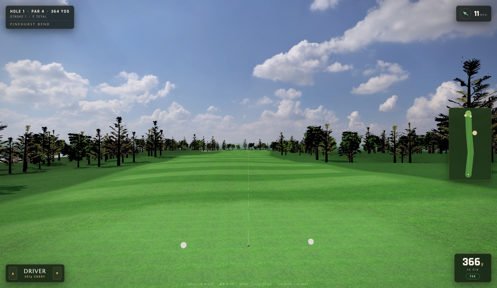
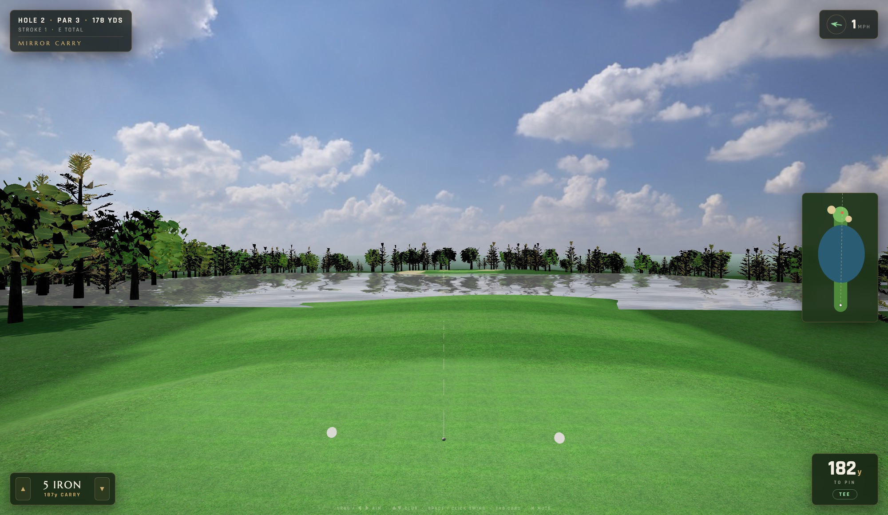

# GSPro — Web Edition

A browser-based golf simulator: a full 18-hole round at Pine Hollow
National (par 72, ~6,900 yards) with real ball-flight physics,
surface-aware bounce and roll, wind, a 3-click swing meter, hole flyovers,
broadcast cameras, shot tracer, minimap, and an OUT/IN scorecard. No build
step, no dependencies to install — three.js loads from a CDN, and all art
assets ship in the repo (~36 MB).

Rendering uses real-world assets: photographed PBR grass/sand textures
splatted across the terrain, an HDRI sky that doubles as image-based
lighting, planar-reflective water, and trees built from photographed branch
textures on alpha-tested cards (the technique real games use). The course
is alive — canopies sway with the hole's wind, cloud shadows drift across
the fairways, birds circle overhead, and the aim camera breathes.




## Run it

```sh
cd gspro
python3 -m http.server 8742
# open http://localhost:8742
```

Any static file server works (the page uses ES modules, so it must be
served over http, not opened as a file).

## Controls

| Input | Action |
|---|---|
| Drag mouse or ◀ ▶ | Aim |
| ▲ ▼ or on-screen buttons | Change club |
| Space / click | Swing meter: start → set power → strike at the line |
| Tab | Scorecard |
| M | Mute |

The meter is a classic 3-click: first click starts the swing, second sets
power (the gold band at the top is 100%), third sets contact as the cursor
falls — hit the bright line at the bottom for a pure strike. Missing early
pushes the shot with fade spin; late pulls it with draw spin.

Every full swing shows live launch-monitor numbers (ball speed, launch,
spin, apex, carry, total) like a real simulator. On the green, a
slope-colored reading grid appears while you line up the putt — blue is
low, red is high.

Hazards play by the rules: water is a one-stroke penalty with a drop at
the point of entry, and each hole has a white-stake out-of-bounds
corridor — finish outside it and it's stroke and distance (+1, replay
from the original spot).

## Play it online

The repo includes a GitHub Pages workflow
([.github/workflows/pages.yml](.github/workflows/pages.yml)). To get a
public play link: make the repository public (Settings → General →
Danger Zone), enable Pages with source "GitHub Actions" (Settings →
Pages), then run the "Deploy to GitHub Pages" workflow from the Actions
tab.

## The course

18 holes, par 72 (36 out / 36 in), four par 3s and four par 5s. Highlights:

- **1 · Pinehurst Bend** (par 4, 364y) — opening dogleg left around a
  fairway bunker.
- **2 · Mirror Carry** (par 3, 178y) — all carry over a pond.
- **5 · Postage Stamp** (par 3, 152y) — a tiny green ringed by three traps.
- **7 · The Gauntlet** (par 5, 549y) — double dogleg with a pond guarding
  the right of the green.
- **10 · Short Grass** (par 4, 357y) — tempting drive over the corner
  bunker.
- **12 · Long March** (par 5, 569y) — the longest walk on the card.
- **15 · River Run** (par 5, 537y) — a river borders the right side, then
  cuts across the layup.
- **17 · Island Look** (par 3, 188y) — long iron over water, bunker long.
- **18 · Clubhouse Turn** (par 4, 425y) — closing dogleg left with water
  on the approach side.

Each hole is ~30 lines of data in [js/holes.js](js/holes.js) — path
waypoints, green/bunker ellipses, water shapes — and the terrain engine
builds everything else.

## Testing

`tools/test.sh` runs a headless regression: a bot plays all 18 holes
through the real terrain and physics (using macOS JavaScriptCore, no Node
needed) and reports a scorecard. A full round currently comes in around
+12 for the bot, with every hole completable.

## How it works

- `js/physics.js` — flight model with quadratic drag (including the dimple
  drag crisis), spin-ratio-saturated Magnus lift, spin decay, surface-aware
  bounce with backspin check-up on greens, and a unified roll/putt
  integrator with slope gravity and cup capture/lip-out. Pure JS, no DOM —
  it also runs under `jsc`/Node for tuning.
- `js/terrain.js` — each hole is one analytic height + surface field
  (fairway corridor, green plateau, bunker bowls, carved water). The same
  field drives the rendered mesh, the vertex-painted surfaces (mowing
  stripes included), and the physics, so the ball plays off exactly what
  you see.
- `js/main.js` — state machine (flyover → aim → meter → flight → resolve),
  cameras, scoring, penalties and drops.
- `js/sky.js`, `js/ui.js`, `js/audio.js` — atmosphere shader, HUD/minimap,
  and synthesized sound.

Dev hooks: `index.html#play` skips the title, `#aim2` jumps straight to
aiming on hole 2.

## Asset credits

- Ground textures (`leafy_grass`, `forrest_ground_01`, `coast_sand_01`),
  HDRI (`kloofendal_48d_partly_cloudy_puresky`), and tree branch textures
  (`pine_tree_01`, `tree_small_02`) — [Poly Haven](https://polyhaven.com),
  CC0.
- Water normal map — [three.js examples](https://github.com/mrdoob/three.js),
  MIT.
